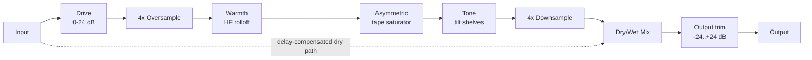

# Architecture

## Signal flow

Drive through Tone is the "wet" path, owned by `AureateEngine` (`src/dsp/AureateEngine.{h,cpp}`). The Warmth HF-rolloff filter, the tape saturator, and the Tone tilt shelves all run *inside* the 4x oversampled block - the harmonics the saturator generates, and the filters shaping the signal around it, are all processed and band-limited at 4x the host sample rate before a single downsample step. The dry path is the untouched input signal, delayed to stay time-aligned with the wet path (see [Latency and oversampling](#latency-and-oversampling) below), then blended in at the Mix stage via `juce::dsp::DryWetMixer`. Output is a final master trim applied *after* the mix, so - unlike Drive, which only affects the wet path - it scales the combined dry+wet signal as a whole.

## Module map

| Directory | Responsibility |
|---|---|
| `src/dsp` | All audio-thread DSP: `TapeSaturator` (the stateless asymmetric tanh nonlinearity) and `AureateEngine` (the full signal chain: Drive gain, oversampling, Warmth low-pass + saturator + Tone tilt shelves inside the oversampled domain, dry/wet mix, Output gain). No allocation, locks, or I/O once `prepare()` has run. Independent of `juce::AudioProcessor` so it is directly unit-testable (see `tests/EngineTests.cpp`, `tests/TapeSaturatorTests.cpp`). |
| `src/params` | Parameter layout and `AudioProcessorValueTreeState` definitions - parameter IDs, ranges, defaults. Single source of truth for what a preset captures. |
| `src/PluginProcessor.*` | Host plumbing: APVTS construction, `prepareToPlay`/`processBlock`/`reset`, latency reporting, state save/load. Reads APVTS values and pushes them into `AureateEngine` every block; does not implement any DSP itself. |
| `src/PluginEditor.*` | A simple, functional v0.1 GUI: one rotary slider per parameter bound via `SliderAttachment`. A custom vector-drawn GUI is a later milestone. |

Dependency direction is one-way: `PluginEditor` -> `params` (via attachments) and `PluginProcessor` -> `params` + `dsp`. `src/dsp` has no upward dependency on the processor or UI, which is what keeps `AureateEngine` testable in isolation.

## Latency and oversampling

The Warmth low-pass, tape saturator, and Tone tilt shelves all run inside a 4x oversampled block (`juce::dsp::Oversampling<float>`, half-band polyphase IIR, `useIntegerLatency = true`), so the saturator's harmonics are generated and filtered at 4x the host sample rate before being downsampled back, keeping aliasing out of the audible band. This oversampling is the *only* source of the plugin's reported latency: `AureateEngine::getLatencySamples()` returns `oversampler.getLatencyInSamples()` (an exact integer, since `useIntegerLatency` is enabled), and `AureateAudioProcessor::prepareToPlay()` reports it to the host via `setLatencySamples()`, so host-side plugin delay compensation (PDC) accounts for the whole chain.

The dry path used by the Mix control has to stay time-aligned with this delayed wet path. Rather than a hand-rolled delay line, `AureateEngine` uses `juce::dsp::DryWetMixer`: the pre-processing signal is captured via `pushDrySamples()` before any wet-path processing touches the buffer, and `setWetLatency(getLatencySamples())` configures the mixer's internal delay line to match. `mixWetSamples()` then blends the two back together, so at Mix = 0% the output (before the final Output trim) is a sample-accurate passthrough of the input, once shifted by `getLatencySamples()` (this is exactly what `tests/EngineTests.cpp`'s null test verifies, to < -90 dBFS residual, with Output pinned to 0 dB so it doesn't itself perturb the passthrough).

One JUCE 8.0.14 behaviour worth calling out because it cost real debugging time (see `tests/DryWetMixerContractTests.cpp`): `DryWetMixer`'s internal dry/wet gain smoothers default their *target* to fully wet (`mix == 1.0`) until `setWetMixProportion()` is called, and the mixer's own `reset()` (invoked from its `prepare()`) only snaps the smoothers' *current* value to whatever *target* is set at that moment - it has no idea what the "real" starting Mix parameter value should be. Skipping this would mean a freshly prepared engine audibly ramps in from 100% wet over the mixer's internal ~50ms default ramp on every `prepareToPlay()`, regardless of the actual Mix parameter. `AureateEngine::prepare()` works around this by calling `dryWetMixer.setWetMixProportion(lastMixProportion)` *before* its own `reset()` runs, so the mixer is already sitting at the correct dry/wet balance from the very first `process()` call.

The Warmth low-pass and Tone tilt shelves are 2nd-order IIR filters (`juce::dsp::IIR::Coefficients::makeLowPass`/`makeLowShelf`/`makeHighShelf`, Q = 1/sqrt(2)) running inside the oversampled domain, and are not part of the reported latency - like any IIR filter, they have their own small, frequency-dependent group delay, treated as ordinary filter/EQ character rather than something to compensate. Because three of these filters are cascaded back-to-back at the oversampled rate, the residual group delay left over after downsampling is not always an integer number of base-rate samples; `tests/EngineTests.cpp`'s near-unity test accounts for this by searching a small alignment window and by treating RMS gain (not just waveform correlation) as the primary "near-unity" measure.

## Parameter smoothing

- **Drive** and **Output** are plain gain stages (`juce::dsp::Gain<float>`), which ramp sample-accurately via their own internal `SmoothedValue` (`setRampDurationSeconds`).
- **Warmth** drives two quantities: a low-pass cutoff (smoothed multiplicatively, appropriate for a log-perceived Hz quantity) and the saturator's bias (smoothed linearly). **Tone**'s tilt gain (in dB) is also smoothed linearly. Recomputing IIR coefficients involves trig calls, so these are not cheap to interpolate per sample; instead each is smoothed with a `juce::SmoothedValue` and the filter coefficients are recomputed once per block from the smoothed value - a standard real-time-safe compromise.
- **Mix** is smoothed both by the engine's own `juce::SmoothedValue<float, ValueSmoothingTypes::Linear>` (feeding `DryWetMixer::setWetMixProportion()` once per block) and by `DryWetMixer`'s own internal ~50ms ramp on top of that.
- All smoothers are seeded to their real starting value in `AureateEngine::prepare()` (see `lastWarmthProportion01`/`lastTiltProportion`/`lastMixProportion`), so re-preparing (sample-rate change, etc.) never resets a live parameter back to a built-in default or lets a smoother ramp from an invalid starting point.

## Real-time safety

- `AureateAudioProcessor::processBlock()` starts with `juce::ScopedNoDenormals`.
- All DSP state (filters, the oversampler, the dry/wet delay line) is allocated in `prepare()`/`prepareToPlay()` and never reallocated on the audio thread. The Warmth low-pass and Tone tilt shelves are prepared with a `juce::dsp::ProcessSpec` scaled to the oversampled rate/block size, computed once in `prepare()`.
- `reset()` clears all filter/oversampler/delay-line state without deallocating (`AureateEngine::reset()`, called from both `AudioProcessor::reset()` and internally from `prepare()`).
- Parameter values are read via `apvts.getRawParameterValue()` atomics in `processBlock()`, never via `apvts.getParameter()->getValue()` (which is not guaranteed lock/allocation-free) and never via `String`-keyed lookups on the audio thread.
- `AureateEngine::process()` treats a zero-sample block as a safe no-op before touching any filter/oversampler state.
- Filter frequencies passed to `IIR::Coefficients::makeLowPass`/`makeLowShelf`/`makeHighShelf` are clamped below the relevant Nyquist (`clampBelowNyquist`, in `AureateEngine.cpp`) - the oversampled rate for the Warmth low-pass and Tone shelves - as defensive insurance against invalid coefficients at unusual sample rates.
