# Architecture

## Signal flow

```mermaid
flowchart LR
    IN[Input] --> WF["Wow/Flutter<br/>independent wow+flutter<br/>modulated delay"]
    WF --> DRIVE[Drive<br/>0-24 dB]
    DRIVE --> UP[4x Oversample]
    UP --> WLP[Warmth<br/>HF rolloff]
    WLP --> BUMP[LF head bump<br/>tape transport resonance]
    BUMP --> SAT[Saturator<br/>Character: Tape/Console/Valve<br/>Warmth+Bias asymmetry]
    SAT --> TILT[Tone<br/>dual-shelf tilt]
    TILT --> TRIM[HF/LF Trim<br/>shelves]
    TRIM --> HISS[Hiss<br/>HF-shelved noise]
    HISS --> DOWN[4x Downsample]
    DOWN --> MIX[Dry/Wet Mix]
    IN -.->|delay-compensated dry path| MIX
    MIX --> OUT[Output trim<br/>-24..+24 dB]
    OUT --> FINAL[Output]
```

Wow/Flutter through Drive run at the host sample rate; Warmth's HF-rolloff, the LF head bump, the saturator, Tone, HF/LF Trim, and Hiss (including its own dedicated HF-shelf shaping filter) all run *inside* the 4x oversampled block, owned by `AureateEngine` (`src/dsp/AureateEngine.{h,cpp}`) - the harmonics the saturator generates, the noise Hiss injects, and the filters shaping the signal around them are all processed and band-limited at 4x the host sample rate before a single downsample step. The dry path is the untouched input signal, delayed to stay time-aligned with the wet path (see [Latency and oversampling](#latency-and-oversampling) below), then blended in at the Mix stage via `juce::dsp::DryWetMixer`. Output is a final master trim applied *after* the mix, so - unlike Drive, which only affects the wet path - it scales the combined dry+wet signal as a whole.

**v0.2.0 research-derived revision** (see `docs/design-brief.md` for the full brief and `docs/research-notes.md` for its sourced citations): the Character models' harmonic-balance ordering was corrected (Tape most odd-dominant, Valve most even-dominant, Console a soft/transparent-until-pushed knee replacing v0.1's hard-flat cubic clip), a new LF head-bump stage was added, Hiss's spectral tilt was corrected to read as HF-forward rather than darkened, and Wow/Flutter's single joint parameter was split into independent Wow and Flutter amounts. None of this is calibrated against measured hardware - see the brief's own Honesty section (§6).

## Module map

| Directory | Responsibility |
|---|---|
| `src/dsp` | All audio-thread DSP: `TapeSaturator` (the stateless saturation nonlinearities - Tape's tanh curve, Console's scaled-tanh soft knee (v0.2.0, replacing v0.1's hard-flat cubic soft-clip), and Valve's exponential curve, selected by Character) and `AureateEngine` (the full signal chain: independent Wow/Flutter modulated delay, Drive gain, oversampling, Warmth low-pass + LF head-bump peak + saturator + Tone tilt shelves + HF/LF Trim shelves + Hiss noise (with its own HF-shelf shaping filter) inside the oversampled domain, dry/wet mix, Output gain). No allocation, locks, or I/O once `prepare()` has run. Independent of `juce::AudioProcessor` so it is directly unit-testable (see `tests/EngineTests.cpp`, `tests/EngineFeatureTests.cpp`, `tests/WowFlutterTests.cpp`, `tests/TapeSaturatorTests.cpp`, `tests/DesignBriefV2Tests.cpp`). |
| `src/params` | Parameter layout and `AudioProcessorValueTreeState` definitions - parameter IDs, ranges, defaults. Single source of truth for what a preset captures. |
| `src/presets` | The M2 preset system (`.scaffold/specs/preset-system-m2.md`): `PresetManager` (factory/user preset discovery, load/save/import/export, dirty tracking, default resolution), `PresetBar` (the editor's preset strip), `Localisation` (the German i18n frame). Copy-paste-portable from sibling `basilica-audio/nave`'s pilot implementation - see that repo's `docs/preset-system-notes.md` for the replication recipe. |
| `src/PluginProcessor.*` | Host plumbing: APVTS construction, `prepareToPlay`/`processBlock`/`reset`, latency reporting, state save/load (including the v0.1.0->v0.2.0 Wow/Flutter state migration), `PresetManager` construction/wiring. Reads APVTS values and pushes them into `AureateEngine` every block (via the shared `pushParametersToEngine()` helper, used by both `prepareToPlay()` and `processBlock()` so the two can never drift apart); does not implement any DSP itself. |
| `src/PluginEditor.*` | A simple, functional v0.1/v0.2 GUI: the M2 `PresetBar` strip docked at the top, then one rotary slider per float parameter (plus a combo box for the Character choice parameter), bound via `SliderAttachment`/`ComboBoxAttachment`, laid out in a wrapping grid in signal-flow order. A custom vector-drawn GUI is a later milestone. |

Dependency direction is one-way: `PluginEditor` -> `params` + `presets` (via attachments/PresetBar) and `PluginProcessor` -> `params` + `dsp` + `presets`. `src/dsp` has no upward dependency on the processor, UI, or preset system, which is what keeps `AureateEngine` testable in isolation.

## Latency and oversampling

The Warmth low-pass, the LF head bump, the saturator, the Tone tilt shelves, the HF/LF Trim shelves, and Hiss (plus its own HF-shelf shaping filter) all run inside a 4x oversampled block (`juce::dsp::Oversampling<float>`, half-band polyphase IIR, `useIntegerLatency = true`), so the saturator's harmonics (and Hiss's noise) are generated and filtered at 4x the host sample rate before being downsampled back, keeping aliasing out of the audible band. This oversampling is one of *two* sources of the plugin's reported latency - the other is Wow/Flutter's fixed base delay (see below). `AureateEngine::getLatencySamples()` returns the sum of `oversampler.getLatencyInSamples()` (an exact integer, since `useIntegerLatency` is enabled) and Wow/Flutter's base delay in samples (also rounded to an exact integer at prepare() time), and `AureateAudioProcessor::prepareToPlay()` reports the total to the host via `setLatencySamples()`, so host-side plugin delay compensation (PDC) accounts for the whole chain.

The dry path used by the Mix control has to stay time-aligned with this delayed wet path. Rather than a hand-rolled delay line, `AureateEngine` uses `juce::dsp::DryWetMixer`: the pre-processing signal is captured via `pushDrySamples()` before any wet-path processing (including Wow/Flutter) touches the buffer, and `setWetLatency(getLatencySamples())` configures the mixer's internal delay line to match. `mixWetSamples()` then blends the two back together, so at Mix = 0% the output (before the final Output trim) is a sample-accurate passthrough of the input, once shifted by `getLatencySamples()` (this is exactly what `tests/EngineTests.cpp`'s null test verifies, to < -90 dBFS residual, with Output pinned to 0 dB so it doesn't itself perturb the passthrough - `tests/SampleRateSweepTests.cpp` repeats the same check across the whole 44.1-192 kHz sample-rate range). The `DryWetMixer`'s internal delay-line capacity (`dryWetMixer { 8192 }` in `AureateEngine.h`) is sized well above the worst-case total latency at the highest supported sample rate - a too-small capacity here previously caused the dry-path delay compensation to silently misbehave at high sample rates once Wow/Flutter's base delay was added to `getLatencySamples()`, so this margin is deliberate, not decorative.

## Wow/Flutter

Wow/Flutter models tape-transport speed instability - a slow "wow" (0.7 Hz) plus a faster "flutter" (11 Hz as of v0.2.0, up from v0.1.0's 6.5 Hz - see `docs/design-brief.md` §3.6) sine LFO, summed and used to modulate the delay time of a `juce::dsp::DelayLine<float, DelayLineInterpolationTypes::Lagrange3rd>` that the wet signal passes through at the host sample rate, ahead of Drive/oversampling. **v0.2.0 breaking change**: the single v0.1.0 "Wow/Flutter" proportion is now two independent parameters (`wow`/`flutter`, `AureateEngine::setWowProportion()`/`setFlutterProportion()`), each scaling only its own LFO's depth - see `PluginProcessor.cpp`'s `setStateInformation()` for the tolerant v0.1.0-state migration this required. A small **fixed base delay** (`wowFlutterBaseDelayMs`, 6 ms) is always present, even at 0%/0% amounts - only the *depth* of each LFO scales with its own parameter, not the shared base delay. This is a deliberate design choice: it means Wow/Flutter's contribution to `getLatencySamples()` depends only on `prepare()`-time constants (the sample rate), never on either live parameter value, so automating Wow or Flutter during playback never changes the plugin's reported latency mid-stream (something hosts generally do not expect a plugin to do). The base delay is rounded to an exact integer sample count at every sample rate (`std::round`, not just truncation), so at 0%/0% amounts the delay line behaves as a genuinely linear, time-invariant pure delay with no sub-sample interpolation smoothing - this is what keeps the dry/wet null test exact regardless of sample rate, without any special-casing for Wow/Flutter in the null-test logic itself.

## Character and the saturator

`TapeSaturator` (`src/dsp/TapeSaturator.h`) implements three stateless, allocation-free nonlinearities, selected by the Character parameter and applied per-sample inside the oversampled block:

- **Tape** (default): the original asymmetric tanh curve, `y = tanh(x + bias) - tanh(bias)` - a smooth, "infinite" soft-compression curve, the most odd-harmonic-dominant/least asymmetric of the three.
- **Console**: an asymmetric scaled-tanh soft knee (`y = k*tanh((x+bias)/k) - k*tanh(bias/k)`, `k = 2`) - **v0.2.0 change**, replacing v0.1's hard-flat cubic soft-clip. Stays closer to linear at low-to-moderate levels than Tape's plain tanh (its cubic Taylor coefficient is smaller), only showing character once driven well past unity - the "least characterful until pushed" archetype the research class suggests, inverting v0.1's ordering (Console was previously the hardest-clipping of the three).
- **Valve**: an asymmetric exponential saturation curve (`sign(v) * (1 - exp(-|v|))`) - strictly monotonic, the most asymmetric/even-harmonic-forward of the three.

All three follow the same "shift by bias, then subtract the curve's value at bias" shape as the original Tape model, so `processSample(0, bias, model) == 0` for every model (no DC injected into silence) and every model produces genuinely asymmetric ceilings under a nonzero bias. The `bias` argument passed to the Character-selected curve is `combinedBias = clamp(warmthBias + explicitBias, +/-maxCombinedBias)` - the sum of Warmth's own bias contribution and the independent Bias parameter's contribution, clamped so automating both to their extremes simultaneously can't push the saturator into a fully one-sided operating point.

**v0.2.0 change**: Warmth's own bias contribution now scales to a **Character-dependent** ceiling (`AureateEngine::characterMaxWarmthBias()`) rather than v0.1's single shared `warmthMaxBias = 0.3`: Tape 0.12 (least asymmetric - real tape hysteresis is close to symmetric/odd-dominant), Console 0.10 (moderate), Valve 0.30 (most asymmetric, kept at v0.1's old shared ceiling - the authentically single-ended/even-harmonic-forward archetype). This is what makes "Warmth means something different per Character" literally true, not just true via the different curve shape - see `docs/design-brief.md` §3.3 for the full research-derived rationale and `tests/DesignBriefV2Tests.cpp` for the executable proof.

## LF head bump

**New in v0.2.0** (`docs/design-brief.md` §3.2): a gentle resonant peak (`headBumpPeak`, a `juce::dsp::IIR::Coefficients::makePeakFilter`-derived `ProcessorDuplicator`) centered at 80 Hz, Q 0.9, scaling linearly from 0 dB at 0% Warmth to +1.5 dB at 100% Warmth - modelling the speed-dependent tape-transport head-bump resonance the v0.1 chain never modelled at all (it only ever shaped the top end). Runs immediately after the Warmth low-pass and before the saturator. A single-point approximation, not a measured curve for any specific tape speed/machine (Aureate has no discrete tape-speed control to key off of) - see the brief's Honesty section (§6).

## Tone (dual-shelf tilt)

Tone is a pair of independently-parameterized shelves (`tiltLowShelfHz` 200 Hz, `tiltHighShelfHz` 4 kHz), moved in opposite directions by the Tone control so 0% leaves both flat. **v0.2.0 documentation-only change**: this is honestly described as a **dual independent-corner shelf pair**, not an unqualified "console-style tilt EQ" - canonical tilt topologies pivot around a *single* frequency (research notes §7), whereas Tone uses two different, fixed corners. No range/topology change; the existing behaviour already does what the manual promises (separating Tone's broad balance from Trim's narrower adjustments), it was just over-claiming its own topology purity.

## HF/LF Trim

Two additional shelf filters (`hfTrimShelf` at 8 kHz, `lfTrimShelf` at 150 Hz), running inside the oversampled domain immediately after Tone's tilt shelves, deliberately at different corner frequencies than Tone (200 Hz/4 kHz) so the two controls feel distinct rather than redundant: Tone reshapes the broad midrange balance in one gesture, HF/LF Trim make an independent, narrower-focused adjustment at the extremes on top of it.

## Hiss

Hiss adds shaped noise (`juce::Random`, fixed-seed for reproducible tests) to the wet signal inside the oversampled domain, after the saturator/Tone/Trim stages and before downsampling. **v0.2.0 spectral-tilt fix** (`docs/design-brief.md` §3.5): the raw noise tap is now routed through its own dedicated `hissShelf` high-shelf filter (+4 dB above 4 kHz, fixed, primed once in `prepare()`) before being added to the wet signal - generated into a pre-allocated `hissScratchBuffer` (sized in `prepare()`, never on the audio thread), filtered, then summed into the oversampled block. Previously the noise inherited only the downsampler's own gentle darkening, reading as "muffled static" rather than the HF-forward broadband hiss real tape machines produce; the dedicated shelf corrects that without changing the deterministic-noise/real-time-safety properties. Noise is generated independently per channel (unlike Wow/Flutter's channel-linked modulation), matching how tape hiss is typically decorrelated between the two channels of a stereo recording. The amount-to-gain mapping is linear (not dB-skewed), so 0% is exactly silent - no noise floor at all when off, rather than merely very quiet.

## Gain-staging calibration note

**New in v0.2.0, documentation only** (`docs/design-brief.md` §3.7): Drive/Warmth's defaults are documented as tuned assuming a nominal **-18 dBFS RMS** input level (the widely-cited tape "0 VU" calibration convention). No DSP behaviour changes - this just explains why the default 6 dB of Drive reads differently on a hot digital bus versus a conservatively gain-staged one, and anchors the M2 factory presets' use of Drive/Output as a matched gain-staging pair.

## Parameter smoothing

- **Drive** and **Output** are plain gain stages (`juce::dsp::Gain<float>`), which ramp sample-accurately via their own internal `SmoothedValue` (`setRampDurationSeconds`). Note that `juce::dsp::Gain`'s internal `SmoothedValue` defaults its current/target to 0 (silence) until `setGainDecibels`/`setGainLinear` is called at least once - `AureateAudioProcessor` always seeds both from the APVTS state (defaulting to 0 dB/unity) before the first `process()` call, but a hand-constructed `AureateEngine` in a test must call `setDriveDb`/`setOutputDb` explicitly before expecting a nonzero wet signal (several of the tests added for the M1 DSP work tripped over exactly this while under development).
- **Warmth** drives three quantities: a low-pass cutoff (smoothed multiplicatively, appropriate for a log-perceived Hz quantity), the saturator's bias (smoothed linearly, now via the shared `updateWarmthBiasTarget()` helper so both `setWarmthProportion()` and `setCharacter()` keep it in sync with the Character-dependent ceiling), and the LF head-bump gain (smoothed linearly). **Bias**, **Tone**'s tilt gain (in dB), **HF Trim**, and **LF Trim** are also smoothed linearly. **Wow**'s and **Flutter**'s amounts (independent since v0.2.0) and **Hiss**'s amount are smoothed linearly too, once per block, ahead of their own per-sample (Wow/Flutter's LFO phase) or per-sample-random (Hiss's noise) generation. Recomputing IIR coefficients involves trig calls, so the filter-driving smoothers are not cheap to interpolate per sample; instead each is smoothed with a `juce::SmoothedValue` and the filter coefficients (or, for Wow/Flutter and Hiss, the modulation depth/noise gain) are recomputed once per block from the smoothed value - a standard real-time-safe compromise. Hiss's own `hissShelf` filter is the one exception - its coefficients are fixed (not parameter-driven), so it is primed once in `prepare()` and never recomputed in `process()`.
- **Mix** is smoothed both by the engine's own `juce::SmoothedValue<float, ValueSmoothingTypes::Linear>` (feeding `DryWetMixer::setWetMixProportion()` once per block) and by `DryWetMixer`'s own internal ~50ms ramp on top of that.
- All smoothers are seeded to their real starting value in `AureateEngine::prepare()` (see the `last*` member variables), so re-preparing (sample-rate change, etc.) never resets a live parameter back to a built-in default or lets a smoother ramp from an invalid starting point.

## Real-time safety

- `AureateAudioProcessor::processBlock()` starts with `juce::ScopedNoDenormals`.
- All DSP state (filters, the oversampler, the Wow/Flutter delay line, the dry/wet delay line, the Hiss scratch buffer) is allocated in `prepare()`/`prepareToPlay()` and never reallocated on the audio thread. The Warmth low-pass, the LF head bump, the Tone tilt shelves, the HF/LF Trim shelves, and the Hiss shelf are prepared with a `juce::dsp::ProcessSpec` scaled to the oversampled rate/block size, computed once in `prepare()`.
- `reset()` clears all filter/oversampler/delay-line state without deallocating (`AureateEngine::reset()`, called from both `AudioProcessor::reset()` and internally from `prepare()`), and deterministically re-seeds Hiss's noise generator so its contribution stays bit-reproducible across reset()/prepare() cycles.
- Parameter values are read via `apvts.getRawParameterValue()` atomics in `processBlock()` (via `AureateAudioProcessor::pushParametersToEngine()`, shared with `prepareToPlay()`), never via `apvts.getParameter()->getValue()` (which is not guaranteed lock/allocation-free) and never via `String`-keyed lookups on the audio thread.
- `AureateEngine::process()` treats a zero-sample block as a safe no-op before touching any filter/oversampler/delay-line state.
- Filter frequencies passed to `IIR::Coefficients::makeLowPass`/`makeLowShelf`/`makeHighShelf`/`makePeakFilter` are clamped below the relevant Nyquist (`clampBelowNyquist`, in `AureateEngine.cpp`) - the oversampled rate for the Warmth low-pass, LF head bump, Tone shelves, HF/LF Trim shelves, and Hiss shelf - as defensive insurance against invalid coefficients at unusual sample rates.
- Hiss's noise generation (`juce::Random::nextFloat()`) and Wow/Flutter's per-sample delay-line modulation (`std::sin`, `juce::dsp::DelayLine::pushSample`/`popSample`) are allocation-free and lock-free, safe to call from the audio thread inside the per-sample loops in `AureateEngine::process()`.
- `PresetManager` (`src/presets/`) is entirely message-thread-only except its `AudioProcessorValueTreeState::Listener::parameterChanged()` dirty-flag callback, which is a single lock-free `std::atomic<bool>` store - nothing in `processBlock()`/`AureateEngine` ever calls into it. See `src/presets/PresetManager.h`'s class-level docs for the full real-time-safety argument.
